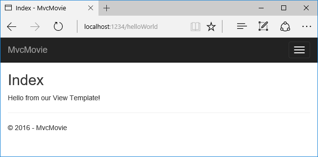
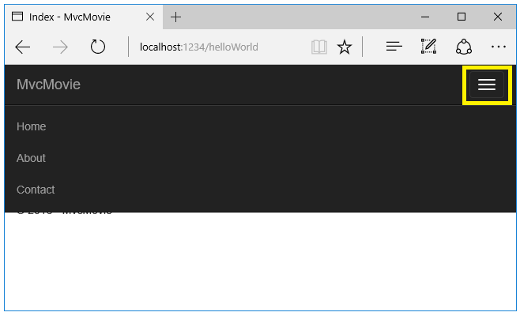

Adding a view
================================================

By `Rick Anderson`_

In this section you're going to modify the ``HelloWorldController`` class to use Razor view template files to cleanly encapsulate the process of generating HTML responses to a client.

You'll create a view template file using Razor. Razor-based view templates have a *.cshtml* file extension, and provide an elegant way to create HTML output using C#. Razor seamlessly blends C# and HTML, minimizing the number of characters and keystrokes required when writing a view template, and enables a fast, fluid coding workflow.
Razor를 사용하여 view template 파일을 만들것이다. Razor-based view template들은 *.cshtml* 파일확장자를 가지고, C#을 사용하여 HTML 출력을 만드는 우아한 방법을 제공한다. Razor는 C# 과 HTML을 섞어서, view template을 작성할때 적은수의 문자와 키입력을 요구하며, 빠르고, 유동적인 코딩 작업을 허용한다.

Currently the ``Index`` method returns a string with a message that is hard-coded in the controller class. Change the ``Index`` method to return a View object, as shown in the following code:
현재 ``Index`` method는 controller class에 하드코딩된 메세지 문자열을 반환한다. 다음의 코드가 보여주는 것처럼,``Index`` method가 View object를 반환하도록 바꿔보자 :

.. literalinclude:: start-mvc/sample/src/MvcMovie/Controllers/HelloWorldController.cs
  :language: c#
  :start-after: #region snippet_4
  :end-before: #endregion
  :dedent: 8

The ``Index`` method above uses a view template to generate an HTML response to the browser. Controller methods (also known as action methods) such as the ``Index`` method above, generally return an ``IActionResult`` (or a class derived from ``ActionResult``), not primitive types like string.

- Right click on the *Views* folder, and then **Add > New Folder** and name the folder *HelloWorld*.
- Right click on the *Views/HelloWorld* folder, and then **Add > New Item**.
- In the **Add New Item - MvcMovie** dialog

  - In the search box in the upper-right, enter *view*
  - Tap **MVC View Page**
  - In the **Name** box, keep the default *Index.cshtml*
  - Tap **Add**

.. image:: adding-view/_static/add_view.png

Replace the contents of the *Views/HelloWorld/Index.cshtml* Razor view file with the following:

.. literalinclude:: start-mvc/sample/src/MvcMovie/Views/HelloWorld/Index.cshtml
  :language: HTML

Navigate to ``http://localhost:xxxx/HelloWorld``. The ``Index`` method in the ``HelloWorldController`` didn't do much work; it simply ran the statement ``return View();``, which specified that the method should use a view template file to render a response to the browser. Because you didn't explicitly specify the name of the view template file to use, MVC defaulted to using the *Index.cshtml* view file in the */Views/HelloWorld* folder. The image below shows the string "Hello from our View Template!" hard-coded in the view.

If your browser window is small (for example on a mobile device), you might need to toggle (tap) the `Bootstrap navigation button <http://getbootstrap.com/components/#navbar>`__ in the upper right to see the to the **Home**, **About**, and **Contact** links.

Changing views and layout pages
--------------------------------------

Tap on the menu links (**MvcMovie**, **Home**, **About**). Each page shows the same menu layout. The menu layout is implemented in the *Views/Shared/_Layout.cshtml* file. Open the *Views/Shared/_Layout.cshtml* file.

:doc:`Layout </mvc/views/layout>` templates allow you to specify the HTML container layout of your site in one place and then apply it across multiple pages in your site. Find the ``@RenderBody()`` line. ``RenderBody`` is a placeholder where all the view-specific pages you create show up, "wrapped" in the layout page. For example, if you select the **About** link, the **Views/Home/About.cshtml** view is rendered inside the ``RenderBody`` method.

.. _change-title-link-reference-label:

Change the title and menu link in the layout file
^^^^^^^^^^^^^^^^^^^^^^^^^^^^^^^^^^^^^^^^^^^^^^^^^^^

Change the contents of the title element. Change the anchor text in the layout template to "MVC Movie" and the controller from ``Home`` to ``Movies`` as highlighted below:

.. literalinclude:: start-mvc/sample/src/MvcMovie/Views/Shared/_Layout.cshtml
  :language: HTML
  :emphasize-lines: 29,6
  :start-after: <snippet_1>
  :end-before: </snippet_1>

.. warning:: We haven't implemented the ``Movies`` controller yet, so if you click on that link, you'll get a 404 (Not found) error.

Save your changes and tap the **About** link. Notice how each page displays the **Mvc Movie** link. We were able to make the change once in the layout template and have all pages on the site reflect the new link text and new title.

Examine the *Views/_ViewStart.cshtml* file:

.. literalinclude:: start-mvc/sample/src/MvcMovie/Views/_ViewStart.cshtml
  :language: HTML

The *Views/_ViewStart.cshtml* file brings in the *Views/Shared/_Layout.cshtml* file to each view. You can use the ``Layout`` property to set a different layout view, or set it to ``null`` so no layout file will be used.

Now, let's change the title of the ``Index`` view.

Open *Views/HelloWorld/Index.cshtml*. There are two places to make a change:

 - The text that appears in the title of the browser
 - The secondary header (``<h2>`` element).

You'll make them slightly different so you can see which bit of code changes which part of the app.

.. literalinclude:: start-mvc/sample/src/MvcMovie/Views/HelloWorld/Index2.cshtml
  :language: HTML
  :emphasize-lines: 2, 5

``ViewData["Title"] = "Movie List";`` in the code above sets the ``Title`` property of the :dn:class:`~Microsoft.AspNetCore.Mvc.ViewFeatures.ViewDataDictionary` to "Movie List". The ``Title`` property is used in the ``<title>`` HTML element in the layout page:

.. code-block:: HTML

  <title>@ViewData["Title"] - Movie App</title>

Save your change and refresh the page. Notice that the browser title, the primary heading, and the secondary headings have changed. (If you don't see changes in the browser, you might be viewing cached content. Press Ctrl+F5 in your browser to force the response from the server to be loaded.) The browser title is created with ``ViewData["Title"]`` we set in the *Index.cshtml* view template and the additional "- Movie App" added in the layout file.

Also notice how the content in the *Index.cshtml* view template was merged with the *Views/Shared/_Layout.cshtml* view template and a single HTML response was sent to the browser. Layout templates make it really easy to make changes that apply across all of the pages in your application. To learn more see :doc:`/mvc/views/layout`.

.. image:: adding-view/_static/hell3.png

Our little bit of "data" (in this case the "Hello from our View Template!" message) is hard-coded, though. The MVC application has a "V" (view) and you've got a "C" (controller), but no "M" (model) yet. Shortly, we'll walk through how to create a database and retrieve model data from it.

Passing Data from the Controller to the View
----------------------------------------------

Before we go to a database and talk about models, though, let's first talk about passing information from the controller to a view. Controller actions are invoked in response to an incoming URL request. A controller class is where you write the code that handles the incoming browser requests, retrieves data from a database, and ultimately decides what type of response to send back to the browser. View templates can then be used from a controller to generate and format an HTML response to the browser.
Database와 model을 이야기 하기 전에, 먼저 controller에서 view로 정보를 전달하는 것에 대하여 이야기 해 보자. Controller action들은 들어오는 URL request의 response 안에서 호출된다. Controller class(당신이 작성한 들어오는 browser request들을 처리하는 코드에 있는)는 database에서 data를 검색하고, 궁극적으로는 어떤 타입의 response을 browser로 되돌려 보낼지 결정한다. View templates can then be used from a controller to generate and format an HTML response to the browser.

Controllers are responsible for providing whatever data or objects are required in order for a view template to render a response to the browser. A best practice: A view template should never perform business logic or interact with a database directly. Instead, a view template should work only with the data that's provided to it by the controller. Maintaining this "separation of concerns" helps keep your code clean, testable and more maintainable.
Controller들은 browser에 response을 표현하는 view template을 위해 요청에서 요구하는 data 또는 object들 무엇이든지 제공할 책임이 있다. 가장 좋은 방법: view template은 절대로 business logic을 수행하거나 database와 직접적으로 상호작용하면 안된다. 대신에, view template은 controller에 의해 제공되는 data로만 작업해야 한다. "관심사의 분리(separation of concerns)"를 유지하는 것은 당신의 코드를 깔끔하고 테스트와 유지보수를 용이하게 돕느다.

Currently, the ``Welcome`` method in the ``HelloWorldController`` class takes a ``name`` and a ``ID`` parameter and then outputs the values directly to the browser. Rather than have the controller render this response as a string, let’s change the controller to use a view template instead. The view template will generate a dynamic response, which means that you need to pass appropriate bits of data from the controller to the view in order to generate the response. You can do this by having the controller put the dynamic data (parameters) that the view template needs in a ``ViewData`` dictionary that the view template can then access.
Currently, the ``Welcome`` method in the ``HelloWorldController`` class takes a ``name`` and a ``ID`` parameter and then outputs the values directly to the browser. Rather than have the controller render this response as a string, let’s change the controller to use a view template instead. View template은 동적인 response를 만들것이고, 이 말은 response를 만들기 위해 order안에서 적당한 data를 controller로부터 view로 전달할 필요가 있다는 것이다. 이 것은 controller가 view template이 필요로하는 동적인 data (parameters)를 view template이 접근할 수 있는``ViewData`` dictionary에 넣는 방법으로 할 수 있다.

Return to the *HelloWorldController.cs* file and change the ``Welcome`` method to add a ``Message`` and ``NumTimes`` value to the ``ViewData`` dictionary. The ``ViewData`` dictionary is a dynamic object, which means you can put whatever you want in to it; the ``ViewData`` object has no defined properties until you put something inside it. The :doc:`MVC model binding system  </mvc/models/model-binding>` automatically maps the named parameters (``name`` and ``numTimes``) from the query string in the address bar to parameters in your method. The complete *HelloWorldController.cs* file looks like this:
Return to the *HelloWorldController.cs* file and change the ``Welcome`` method to add a ``Message`` and ``NumTimes`` value to the ``ViewData`` dictionary. ``ViewData`` dictionary는 동적인 객체이고, 이 말은 원하는 무엇이든 넣을수 있다는 것이다; ``ViewData`` object는  어떤것을 안에 넣기 전까지 정의된 propertie들이 없다. The :doc:`MVC model binding system  </mvc/models/model-binding>` 은 자동적으로 주소표시줄의 query string에서 parameter들 (``name`` and ``numTimes``)을 당신의 method 안에 parameter들로 배치한다. 완성된 *HelloWorldController.cs* file 은 다음과 같다:

.. literalinclude:: start-mvc/sample/src/MvcMovie/Controllers/HelloWorldController.cs
  :language: c#
  :start-after: #region snippet_5
  :end-before: #endregion

The ``ViewData`` dictionary object contains data that will be passed to the view. Next, you need a Welcome view template.
``ViewData`` dictionary object는 view에 전달될 data를 포함한다. 다음으로, Welcome view template이 필요하다.

- Right click on the *Views/HelloWorld* folder, and then **Add > New Item**.
- In the **Add New Item - MvcMovie** dialog

  - In the search box in the upper-right, enter *view*
  - Tap **MVC View Page**
  - In the **Name** box, enter *Welcome.cshtml*
  - Tap **Add**

You'll create a loop in the *Welcome.cshtml* view template that displays "Hello" ``NumTimes``. Replace the contents of *Views/HelloWorld/Welcome.cshtml* with the following:
*Welcome.cshtml* view template 안에 "Hello" ``NumTimes`` 를 표시하는 루프를 만들었다. Replace the contents of *Views/HelloWorld/Welcome.cshtml* with the following:

.. literalinclude:: start-mvc/sample/src/MvcMovie/Views/HelloWorld/Welcome.cshtml
  :language: none

Save your changes and browse to the following URL:

\http://localhost:xxxx/HelloWorld/Welcome?name=Rick&numtimes=4

Data is taken from the URL and passed to the controller using the :doc:`MVC model binder </mvc/models/model-binding>` . The controller packages the data into a ``ViewData`` dictionary and passes that object to the view. The view then renders the data as HTML to the browser.
Data는 :doc:`MVC model binder </mvc/models/model-binding>` 를 사용하여 URL로 부터 가져왔고 controller로 전달되었다. Controller는 ``ViewData`` dictionary 안으로 data를 포장하고 ``ViewData`` dictionary를 view로 전달한다. View는 그때 browser에 HTML로 data를 표현한다.

.. image:: adding-view/_static/rick.png

In the sample above, we used the ``ViewData`` dictionary to pass data from the controller to a view. Later in the tutorial, we will use a view model to pass data from a controller to a view. The view model approach to passing data is generally much preferred over the ``ViewData`` dictionary approach.

Well, that was a kind of an "M" for model, but not the database kind. Let's take what we've learned and create a database of movies. 
